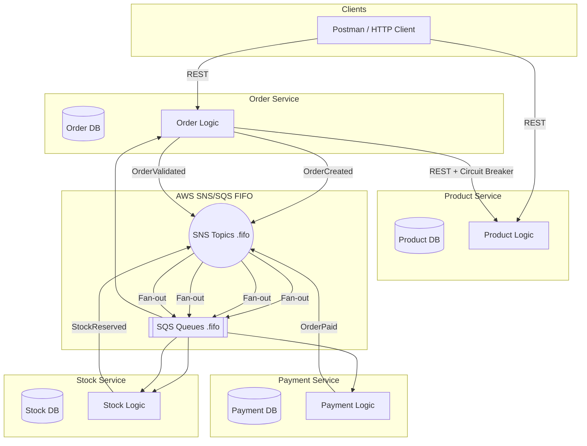
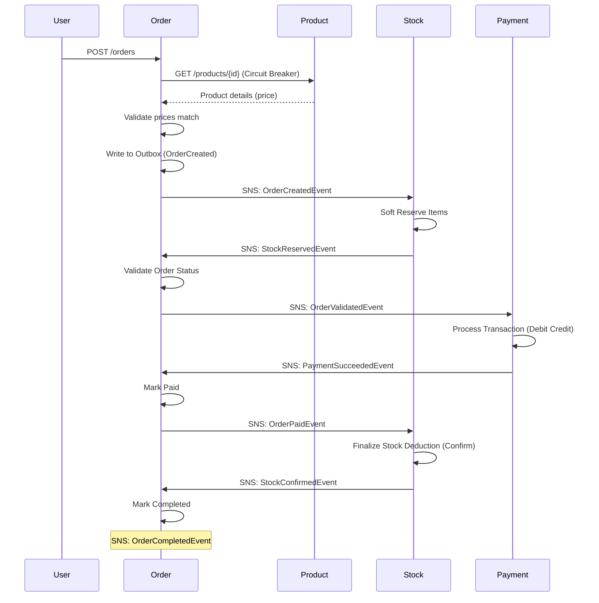
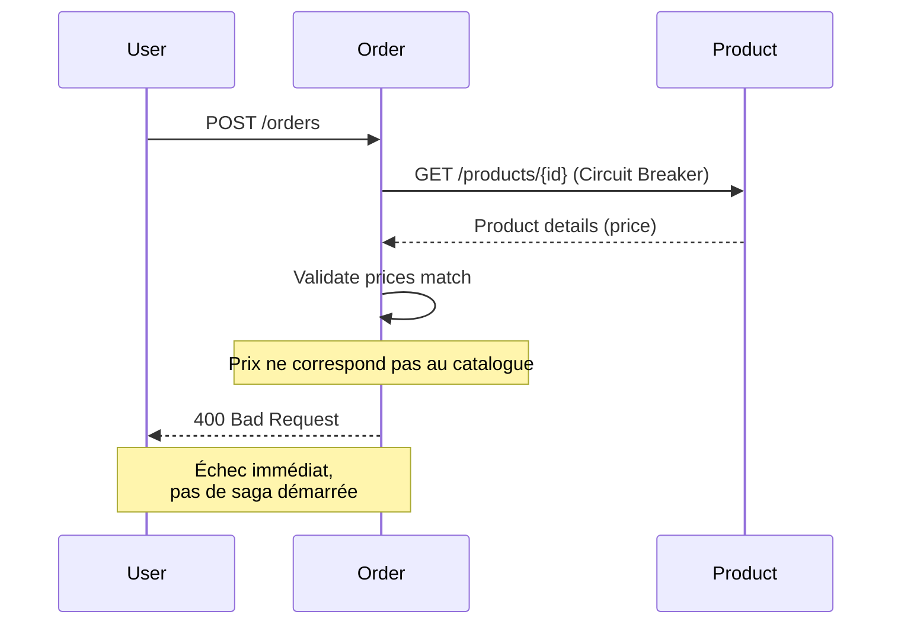
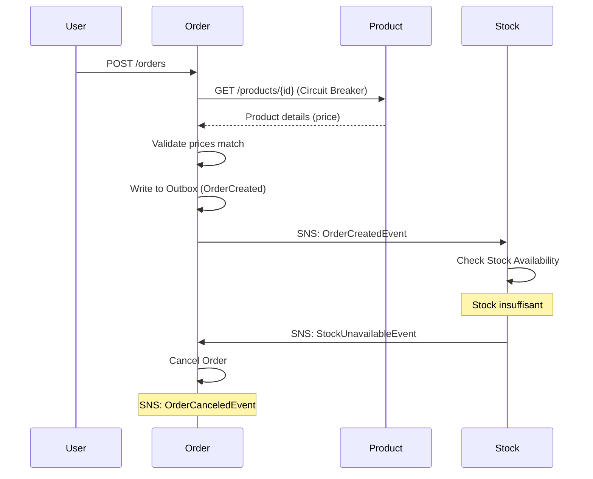
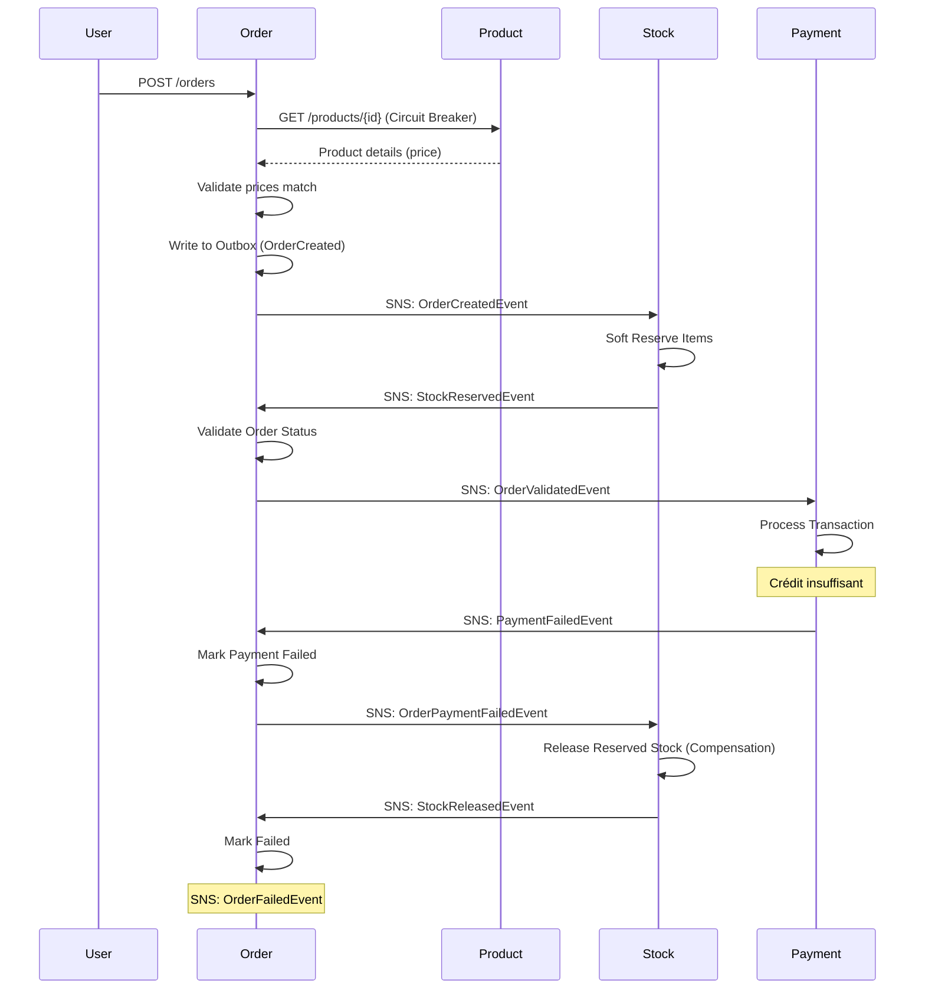

# 🛒 E-commerce Event-Driven Platform (Spring Boot + Kafka + AWS)

## 📌 Description

Cette plateforme démontre une architecture microservices distribuée, robuste et scalable, mettant l'accent sur la cohérence des données et la gestion avancée des erreurs transactionnelles.

### Technologies clés :
* **Spring Boot 4.0+** (Java 25)
* **Messaging** : AWS SNS/SQS ou Kafka suivant profil choisi
* **Outbox Pattern** : Publication fiable des événements via une table de base de données dédiée
* **Saga Pattern** : Orchestration chorégraphiée pour garantir la cohérence inter-services
* **Observabilité** : Tracing distribué avec **Zipkin**, metrics avec **Prometheus** et tableaux de bord **Grafana**
* **Infrastructure** : Docker compose (mode local) et CloudFormation (déploiement AWS)
* **Architecture** : architecture hexagonale et design DDD

## Services 

### 📦 Order Service
**Rôle** : Service central et coordinateur de la saga. Il gère le cycle de vie complet des commandes, de la création jusqu'à la finalisation ou l'annulation.

| Méthode | Endpoint | Description |
|---------|----------|-------------|
| `POST` | `/orders` | Créer une nouvelle commande |
| `GET` | `/orders` | Lister toutes les commandes |

**Appel REST synchrone** :
- Lors de la création d'une commande (`POST /orders`), le service effectue un appel REST synchrone vers le **Product Service** pour valider que les prix des articles correspondent au catalogue.
- Un **circuit breaker** (Resilience4j) protège cet appel contre les défaillances du Product Service.
- Si les prix ne correspondent pas, l'API retourne immédiatement une erreur **400 Bad Request**.

**Messages émis** :
- `OrderCreatedEvent` → notifie de la création d'une commande par l'utilisateur via un POST à l'url /orders, déclanche la réservation du stock
- `OrderValidatedEvent` → valide le fait que les produits de la commande sont en stock, déclenche le paiement
- `OrderPaidEvent` → valide le paiement de la commande, déclenche la déduction finale du stock
- `OrderCanceledEvent` → notifie que la commande est annulée par manque de stock
- `OrderPaymentFailedEvent` → notifie que le paiement de la commande a échouée, déclenche la libération du stock réservé.
- `OrderCompletedEvent` -> notifie du succés final du traitement de la commande (arpès succés de paiement et déduction finale du stock)
- `OrderFailedEvent` → notifie de l'échec final du traiement de la commande (après échec de paiement et liébération du stock)

**Messages traités** :
- `StockReservedEvent` → valide la commande suiet au succés de la réservation du stock
- `StockUnavailableEvent` → annule la commande suite à l'échec de la réservation du stock
- `PaymentSucceededEvent` → marque la commande comme payée suite au succès du paiement
- `PaymentFailedEvent` → marque l'échec du paiement

---

### 🛍️ Product Service
**Rôle** : Service de référentiel produits. Gère le catalogue des produits disponibles à la vente. Appelé de façon synchrone par l'Order Service pour valider les prix lors de la création de commandes.

| Méthode | Endpoint | Description |
|---------|----------|-------------|
| `GET` | `/products` | Lister tous les produits |
| `GET` | `/products/{id}` | Récupérer un produit par son ID |
| `POST` | `/products` | Créer un nouveau produit |

**Appels entrants** :
- `GET /products/{id}` ← appelé par l'Order Service (avec circuit breaker) pour valider les prix

**Messages émis** : Aucun (service de référentiel)

**Messages traités** : Aucun

---

### 📊 Stock Service
**Rôle** : Gère l'inventaire et les réservations de stock. Implémente un système de réservation en deux phases (soft reserve puis confirm/release).

| Méthode | Endpoint | Description |
|---------|----------|-------------|
| `GET` | `/stocks` | Lister tous les articles en stock |
| `POST` | `/stocks` | Ajouter du stock pour un produit |

**Messages émis** :
- `StockReservedEvent` → confirme la réservation du stock
- `StockUnavailableEvent` → signale un stock insuffisant
- `StockConfirmedEvent` → confirme la déduction définitive suite à un paiement réussi
- `StockReleasedEvent` → confirme la libération du stock suite à un échec de paiement

**Messages traités** :
- `OrderCreatedEvent` → réserve le stock (soft reserve) suite à la création de la commande par l'utilisateur
- `OrderPaidEvent` → finalise la déduction du stock suite à la confirmation de paiement
- `OrderPaymentFailedEvent` → libère le stock réservé suite à l'échec du paiement (compensation)

---

### 💳 Payment Service
**Rôle** : Traite les paiements en vérifiant le crédit disponible du client et en débitant le montant de la commande.

| Méthode | Endpoint | Description |
|---------|----------|-------------|
| - | - | *Aucun endpoint HTTP exposé* |

**Messages émis** :
- `PaymentSucceededEvent` → paiement réussi
- `PaymentFailedEvent` → paiement échoué (crédit insuffisant)

**Messages traités** :
- `OrderValidatedEvent` → déclenche le traitement du paiement suite au succès de la réservation du stock

---

Les messages peuvent être envoyés et traités soit par Kafka, soit par SNS et SQS. Une implémentation des services suivant une architecture hexagonale permet notamment un remplacement simple, suivant l'activation d'un profil Spring Boot particulier, d'une implémentation du messaging soit par Kakfa, soit par SNS/SQS (FIFO)

## 🏗️ Architecture globale



## 🔄 Workflow métier (Saga Choreography)

Le projet utilise une Saga chorégraphiée où le service `Order` agit comme coordinateur principal du cycle de vie. L'utilisation de **SNS/SQS FIFO** ou **Kafka** garantit que toutes les étapes pour une même commande sont traitées séquentiellement.

Les diagrammes suivants illustrent les échanges de messages et compensation en cas d'erreur dans le cas nominal et les différents cas d'erreurs.

### ✅ Scénario nominal (succès)



### ❌ Scénario d'échec : Prix invalide (validation synchrone)



### ❌ Scénario d'échec : Stock insuffisant



### ❌ Scénario d'échec : Paiement échoué



## 🧠 Gestion des erreurs & Fiabilité

### Fiabilité de la publication des messages
* **Outbox Pattern** : Les événements sont persistés dans une table `outbox` au sein de la même transaction que les modifications métier, garantissant l'atomicité. Un scheduler (`@Scheduled`) traite ensuite les messages en attente toutes les 5 secondes et les publie vers le broker (SNS ou Kafka).
* **Verrou pessimiste** : L'utilisation de `SELECT FOR UPDATE SKIP LOCKED` permet à plusieurs instances du même service de traiter des messages différents en parallèle sans doublons.
* **Nettoyage automatique** : Les messages traités sont supprimés après 7 jours via un job planifié quotidien.

### Gestion des erreurs (SQS)
* **SQS Error Handler** : Gestionnaire d'erreurs centralisé détectant récursivement les exceptions non-re-tentables (ex: `JacksonException`, `IllegalArgumentException`).
* **DLQ (Dead Letter Queues)** : Redirection automatique vers des files `-dlq.fifo` après 3 tentatives infructueuses pour les erreurs re-tentables.

### Gestion des erreurs (Kafka)
* **DefaultErrorHandler** : Gestionnaire d'erreurs Spring Kafka avec backoff configurable (`FixedBackOff`) pour les retries.
* **DLT (Dead Letter Topics)** : Via `DeadLetterPublishingRecoverer`, les messages en échec sont publiés sur un topic `-dlt` après épuisement des tentatives.
* **Exceptions non-re-tentables** : `DeserializationException`, `IllegalArgumentException`, `CorruptedDataPersistenceException`, `OutboxException` sont envoyées directement en DLT sans retry.

### Idempotence
* **Idempotence** : Chaque consommateur vérifie si l'événement a déjà été traité pour éviter les doubles débits/réservations.

## 📊 Observabilité

Le projet inclut une stack complète d'observabilité accessible en local :

* **Zipkin** : [http://localhost:9411](http://localhost:9411) - Visualisez le tracing distribué de chaque commande.
* **Prometheus** : [http://localhost:9090](http://localhost:9090) - Explorez les metrics techniques.
* **Grafana** : [http://localhost:3000](http://localhost:3000) - Tableaux de bord pré-configurés (Login: `admin / admin`).

## 🐳 Lancer en local (Docker Compose)

Docker compose est utilisé pour déployer l'application localement:

1. **Prérequis** : Docker Desktop, Java 25, Maven.
2. **Lancement des Microservices et de l'instrastructure** (Kafka, Postgres, Prometheus, ...) :
   ```bash
   docker-compose --profile app up --build
   ```

Il est également possible de ne lancer que l'infrastructure, et de lancer les micro services manuellement (via l'IDE par exemple):

**Lancement de l'infrastructure uniquement**:
   ```bash
   docker-compose up -d
   ```

Pour tout supprimer, exécuter:
   ```bash
  docker-compose --profile app down -v
   ```

Suivant que l'on souhaite utiliser Kafka ou SNS/SQS en déploiement local, éditer le fichier ***docker-compose.yaml*** pour spécifier les profils Spring Boot désirés sur les 4 microservices qui y sont définis. Utiliser l'une des 2 possibilités suivantes:

```
SPRING_PROFILES_ACTIVE=docker,aws
SPRING_PROFILES_ACTIVE=docker,kafka
```


## 🚀 Déploiement AWS

Le déploiement sur AWS s'effectue en plusieurs étapes via des stacks CloudFormation et un workflow GitHub Actions.

Note: le déploiement sous AWS utilise uniquement SNS/SQS comme système de messaging. Kafka ne peut pas être utilisé dans ce mode de déploiement.

### Prérequis
- AWS CLI configuré avec les credentials appropriés
- Secrets GitHub configurés : `AWS_ACCESS_KEY_ID` et `AWS_SECRET_ACCESS_KEY`
- VPC par défaut avec au moins 2 subnets publics

### Étape 1 : Création des repositories ECR

Déploie les 4 repositories ECR pour stocker les images Docker des microservices. Chaque repository est configuré avec un scan de sécurité automatique et une politique de rétention (5 dernières images).

```bash
aws cloudformation deploy \
  --template-file infrastructure/cloudformation/ecr-repositories.yaml \
  --stack-name ecommerce-ecr-repositories
```

**Repositories créés** :
- `ecommerce-product-service`
- `ecommerce-order-service`
- `ecommerce-stock-service`
- `ecommerce-payment-service`

### Étape 2 : Build et push des images Docker (GitHub Actions)

Le workflow `Manual Docker Build` (déclenchement manuel) :
1. Compile les 4 microservices avec Maven
2. Build les images Docker via `Dockerfile.ci` (optimisé pour CI)
3. Push les images vers ECR avec le tag `latest`

**Déclenchement** : Actions → Manual Docker Build → Run workflow

### Étape 3 : Infrastructure de messaging (SNS/SQS FIFO)

Déploie l'infrastructure de messaging event-driven avec SNS FIFO pour le fan-out et SQS FIFO pour la consommation ordonnée.

```bash
aws cloudformation deploy \
  --template-file infrastructure/cloudformation/sns-sqs-fifo.yaml \
  --stack-name ecommerce-messaging
```

**Ressources créées** :
| Type | Ressource | Description |
|------|-----------|-------------|
| SNS Topic | `order-events.fifo` | Événements émis par Order Service |
| SNS Topic | `payment-events.fifo` | Événements émis par Payment Service |
| SNS Topic | `stock-events.fifo` | Événements émis par Stock Service |
| SQS Queue | `order-payment-queue.fifo` | Order ← Payment events |
| SQS Queue | `order-stock-queue.fifo` | Order ← Stock events |
| SQS Queue | `payment-order-queue.fifo` | Payment ← Order events |
| SQS Queue | `stock-order-queue.fifo` | Stock ← Order events |
| SQS DLQ | `*-dlq.fifo` | Dead Letter Queues (4) |

### Étape 4 : Base de données RDS PostgreSQL

Déploie une instance RDS PostgreSQL partagée entre tous les services (optimisée coût avec `db.t4g.micro`).

```bash
aws cloudformation deploy \
  --template-file infrastructure/cloudformation/persistence.yaml \
  --stack-name ecommerce-persistence \
  --parameter-overrides \
    VpcId=vpc-xxxxx \
    SubnetIds=subnet-xxxxx,subnet-yyyyy \
    DBUser=postgres \
    DBPassword=your-secure-password
```

**Outputs** : `DBEndpoint`, `DBPort`, `JDBCConnectionString`

### Étape 5 : ECS Fargate et Load Balancer

Déploie le cluster ECS Fargate avec les 4 services, un Application Load Balancer partagé, et les rôles IAM nécessaires.

```bash
aws cloudformation deploy \
  --template-file infrastructure/cloudformation/compute.yaml \
  --stack-name ecommerce-compute \
  --capabilities CAPABILITY_IAM \
  --parameter-overrides \
    VpcId=vpc-xxxxx \
    SubnetIds=subnet-xxxxx,subnet-yyyyy \
    ECRRegistry=123456789.dkr.ecr.eu-west-3.amazonaws.com \
    DBEndpoint=ecommerce-shared-db.xxxxx.eu-west-3.rds.amazonaws.com \
    DBUser=postgres \
    DBPassword=your-secure-password
```

**Architecture déployée** :
- **ECS Cluster** : `ecommerce-cluster`
- **ALB** : Load balancer partagé avec routing par path (`/products/*`, `/orders/*`, `/stocks/*`)
- **Services Fargate** : 4 tasks (1 par microservice)
- **IAM Roles** : Execution Role (ECR, CloudWatch) + Task Role (SNS, SQS)
- **CloudWatch Logs** : `/ecs/ecommerce-cluster` (rétention 1 jour)

### Ordre de déploiement

```
1. ecr-repositories.yaml
2. [GitHub Actions] Build & Push images
3. sns-sqs-fifo.yaml
4. persistence.yaml
5. compute.yaml
```
## 🧪 Exemples d'utilisation (curl)

Une fois l'application démarrée, voici un exemple de flux complet pour créer et consulter une commande (remplacer localhost:xxxx par l'URL du loadbalancer AWS pour un déploiement AWS).

### 1. Créer un produit

```bash
curl -X POST http://localhost:8081/products \
  -H "Content-Type: application/json" \
  -d '{
    "name": "Laptop Pro",
    "description": "Ordinateur portable haute performance",
    "price": 999.99
  }'
```

**Réponse** :
```json
{
  "id": "e38cfaa4-5c32-45c4-bf1b-57b5466468d4",
  "name": "Laptop Pro",
  "description": "Ordinateur portable haute performance",
  "price": 999.99
}
```

### 2. Ajouter du stock pour ce produit

```bash
curl -X POST http://localhost:8083/stocks \
  -H "Content-Type: application/json" \
  -d '{
    "productId": "e38cfaa4-5c32-45c4-bf1b-57b5466468d4",
    "quantity": 10
  }'
```

### 3. Créer une commande

```bash
curl -X POST http://localhost:8082/orders \
  -H "Content-Type: application/json" \
  -d '{
    "customerId": "d7e2b910-f2f4-48de-9fdf-db3ae27efb90",
    "items": [
      {
        "productId": "e38cfaa4-5c32-45c4-bf1b-57b5466468d4",
        "quantity": 2,
        "price": 999.99
      }
    ]
  }'
```

A noter que le client avec l'id d7e2b910-f2f4-48de-9fdf-db3ae27efb90 est un client prédéfini avec un crédit de 2000. Donc, si vous exécutez une autre commande pour ce même client, la commande sera rejetée pour fonds insuffisants.

**Réponse** (commande créée, saga démarrée) :
```json
{
  "orderId": "a1b2c3d4-e5f6-7890-abcd-ef1234567890",
  "customerId": "d7e2b910-f2f4-48de-9fdf-db3ae27efb90",
  "createdAt":"2026-04-20T17:13:41.707000835Z",
  "status": "PENDING",
  "items": [
    {
      "productId": "e38cfaa4-5c32-45c4-bf1b-57b5466468d4",
      "quantity": 2,
      "price": 999.99
    }
  ]  
}
```

### 4. Récupérer toutes les commandes

```bash
curl http://localhost:8082/orders
```

**Réponse** (après traitement de la saga) :
```json
[
  {
    "orderId": "a1b2c3d4-e5f6-7890-abcd-ef1234567890",
    "customerId": "d7e2b910-f2f4-48de-9fdf-db3ae27efb90",
    "createdAt":"2026-04-20T17:13:41.707000835Z",
    "status": "COMPLETED",
    "items": [...]    
  }
]
```

> **Note** : Le statut évolue automatiquement via la saga : `PENDING` → `RESERVED` → `PAID` → `COMPLETED`

> **Note** : Pour tester le cas d'échec, vous pouvez essayer de créer une autre commande avec le même client qui n'a plus de fonds. Le status évoluera via la saga `PENDING` → `RESERVED` → `PAYMENT_FAILED` → `FAILED`

---
Projet réalisé dans le cadre d’un portfolio backend/cloud engineering.