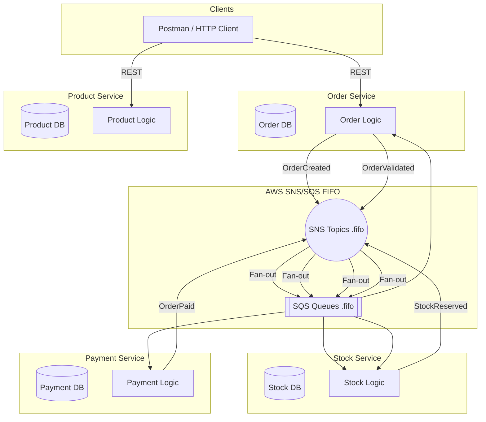
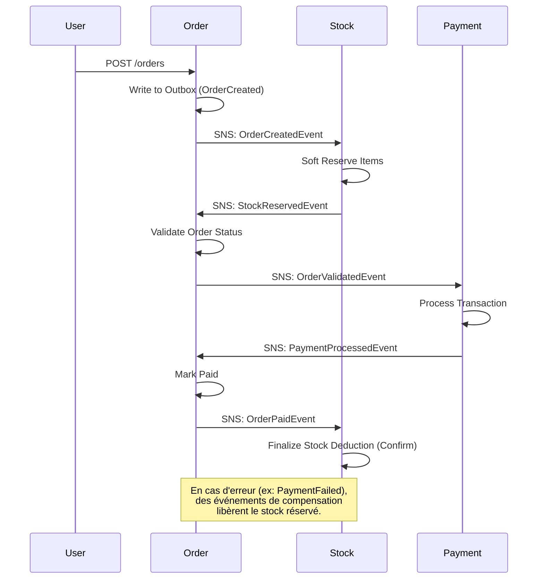

# 🛒 E-commerce Event-Driven Platform (Spring Boot + Kafka + AWS)

## 📌 Description

Cette plateforme démontre une architecture microservices distribuée, robuste et scalable, mettant l'accent sur la cohérence des données et la gestion avancée des erreurs transactionnelles.

### Technologies clés :
* **Spring Boot 4.0+** (Java 25)
* **Messaging** : AWS SNS/SQS ou Kafka suivant profil choisi
* **Outbox Pattern** : Publication fiable des événements via une table de base de données dédiée
* **Saga Pattern** : Orchestration chorégraphiée pour garantir la cohérence inter-services
* **Observabilité** : Tracing distribué avec **Zipkin**, metrics avec **Prometheus** et tableaux de bord **Grafana**
* **Infrastructure** : Docker compose (mode local) et CloudFormation (déploiement AWS)
* **Architecture** : architecture hexagonale et design DDD

## Services 

### 📦 Order Service
**Rôle** : Service central et coordinateur de la saga. Il gère le cycle de vie complet des commandes, de la création jusqu'à la finalisation ou l'annulation.

| Méthode | Endpoint | Description |
|---------|----------|-------------|
| `POST` | `/orders` | Créer une nouvelle commande |
| `GET` | `/orders` | Lister toutes les commandes |

**Messages émis** :
- `OrderCreatedEvent` → notifie de la création d'une commande par l'utilisateur via un POST à l'url /orders, déclanche la réservation du stock
- `OrderValidatedEvent` → valide le fait que les produits de la commande sont en stock, déclenche le paiement
- `OrderPaidEvent` → valide le paiement de la commande, déclenche la déduction finale du stock
- `OrderCanceledEvent` → notifie que la commande est annulée par manque de stock
- `OrderPaymentFailedEvent` → notifie que le paiement de la commande a échouée, déclenche la libération du stock réservé.
- `OrderCompletedEvent` -> notifie du succés final du traitement de la commande (arpès succés de paiement et déduction finale du stock)
- `OrderFailedEvent` → notifie de l'échec final du traiement de la commande (après échec de paiement et liébération du stock)

**Messages traités** :
- `StockReservedEvent` → valide la commande suiet au succés de la réservation du stock
- `StockUnavailableEvent` → annule la commande suite à l'échec de la réservation du stock
- `PaymentSucceededEvent` → marque la commande comme payée suite au succès du paiement
- `PaymentFailedEvent` → marque l'échec du paiement

---

### 🛍️ Product Service
**Rôle** : Service de référentiel produits. Gère le catalogue des produits disponibles à la vente.

| Méthode | Endpoint | Description |
|---------|----------|-------------|
| `GET` | `/products` | Lister tous les produits |
| `GET` | `/products/{id}` | Récupérer un produit par son ID |
| `POST` | `/products` | Créer un nouveau produit |

**Messages émis** : Aucun (service de référentiel)

**Messages traités** : Aucun

---

### 📊 Stock Service
**Rôle** : Gère l'inventaire et les réservations de stock. Implémente un système de réservation en deux phases (soft reserve puis confirm/release).

| Méthode | Endpoint | Description |
|---------|----------|-------------|
| `GET` | `/stocks` | Lister tous les articles en stock |
| `POST` | `/stocks` | Ajouter du stock pour un produit |

**Messages émis** :
- `StockReservedEvent` → confirme la réservation du stock
- `StockUnavailableEvent` → signale un stock insuffisant
- `StockConfirmedEvent` → confirme la déduction définitive suite à un paiement réussi
- `StockReleasedEvent` → confirme la libération du stock suite à un échec de paiement

**Messages traités** :
- `OrderCreatedEvent` → réserve le stock (soft reserve) suite à la création de la commande par l'utilisateur
- `OrderPaidEvent` → finalise la déduction du stock suite à la confirmation de paiement
- `OrderPaymentFailedEvent` → libère le stock réservé suite à l'échec du paiement (compensation)

---

### 💳 Payment Service
**Rôle** : Traite les paiements en vérifiant le crédit disponible du client et en débitant le montant de la commande.

| Méthode | Endpoint | Description |
|---------|----------|-------------|
| - | - | *Aucun endpoint HTTP exposé* |

**Messages émis** :
- `PaymentSucceededEvent` → paiement réussi
- `PaymentFailedEvent` → paiement échoué (crédit insuffisant)

**Messages traités** :
- `OrderValidatedEvent` → déclenche le traitement du paiement suite au succès de la réservation du stock

---

Les messages peuvent être envoyés et traités soit par Kafka, soit par SNS et SQS. Une implémentation des services suivant une architecture hexagonale permet notamment un remplacement simple, suivant l'activation d'un profil Spring Boot particulier, d'une implémentation du messaging soit par Kakfa, soit par SNS/SQS (FIFO)

## 🏗️ Architecture globale



## 🔄 Workflow métier (Saga Choreography)

Le projet utilise une Saga chorégraphiée où le service `Order` agit comme coordinateur principal du cycle de vie. L'utilisation de **SNS/SQS FIFO** garantit que toutes les étapes pour une même commande sont traitées séquentiellement.



## 🧠 Gestion des erreurs & Fiabilité
* **SQS Error Handler** : Gestionnaire d'erreurs centralisé détectant récursivement les exceptions non-re-tentables (ex: `JacksonException`, `IllegalArgumentException`).
* **DLQ (Dead Letter Queues)** : Redirection automatique vers des files `-dlq.fifo` après 3 tentatives infructueuses pour les erreurs re-tentables.
* **Idempotence** : Chaque consommateur vérifie si l'événement a déjà été traité pour éviter les doubles débits/réservations.

## 📊 Observabilité

Le projet inclut une stack complète d'observabilité accessible en local :

* **Zipkin** : [http://localhost:9411](http://localhost:9411) - Visualisez le tracing distribué de chaque commande.
* **Prometheus** : [http://localhost:9090](http://localhost:9090) - Explorez les metrics techniques.
* **Grafana** : [http://localhost:3000](http://localhost:3000) - Tableaux de bord pré-configurés (Login: `admin / admin`).

## 🐳 Lancer en local (Docker Compose)

1. **Prérequis** : Docker Desktop, Java 25, Maven.
2. **Lancement de l'infrastructure** (Kafka, Postgres, LocalStack, Metrics) :
   ```bash
   docker-compose up -d
   ```
3. **Lancement des Microservices** (via profil `app`) :
   ```bash
   docker-compose --profile app up --build
   ```

## 🚀 CI/CD

Un workflow **GitHub Actions** (`Manual Docker Build`) est disponible pour valider la construction des images Docker. Il utilise `Buildx` pour optimiser la mise en cache des dépendances Maven.

---
Projet réalisé dans le cadre d’un portfolio backend/cloud engineering.