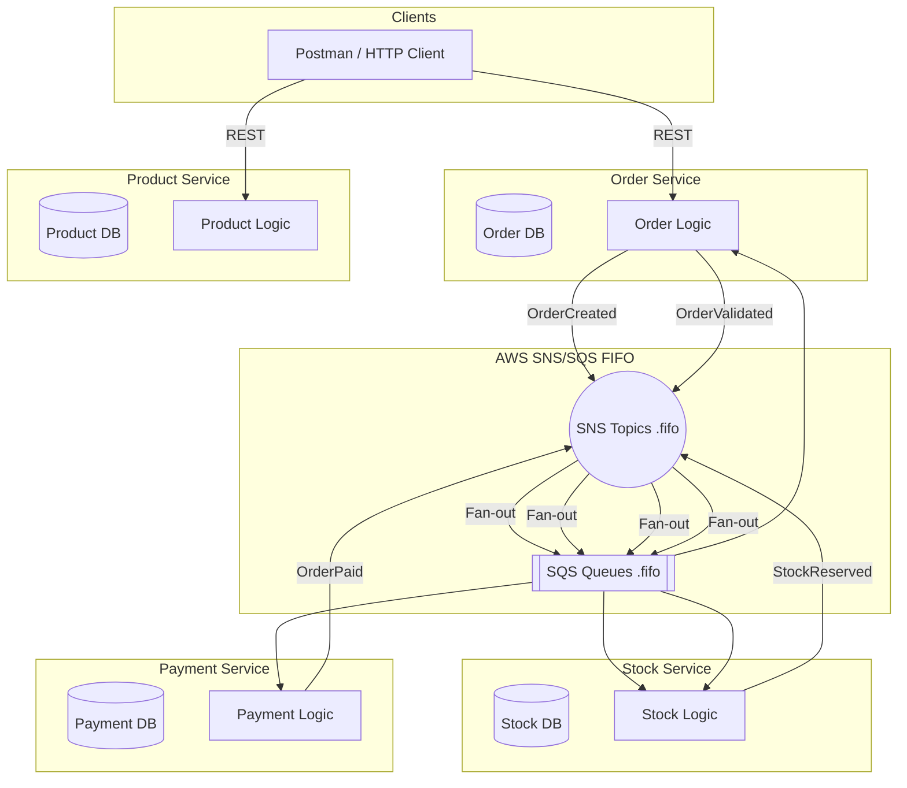
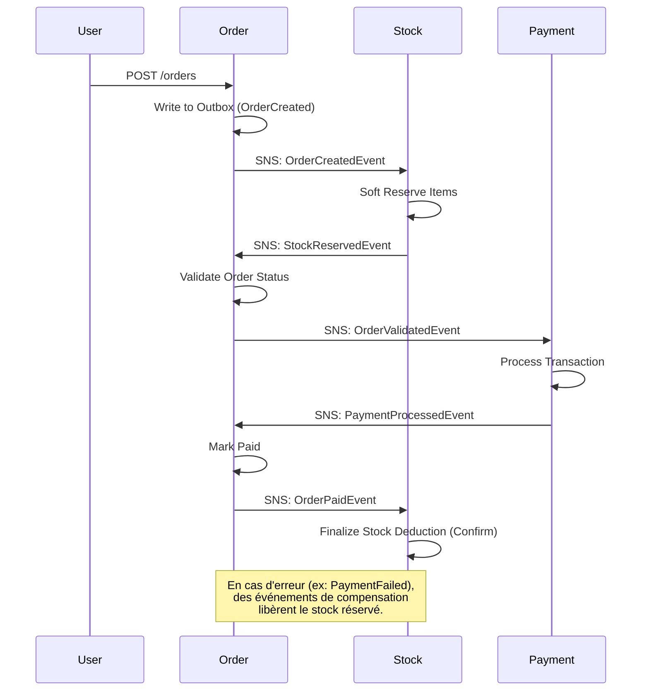

# 🛒 E-commerce Event-Driven Platform (Spring Boot + AWS FIFO)

## 📌 Description

Cette plateforme démontre une architecture microservices distribuée, robuste et scalable, mettant l'accent sur la cohérence des données et la gestion avancée des erreurs transactionnelles.

### Technologies clés :
* **Spring Boot 4.0+** (Java 25)
* **Messaging** : AWS SNS/SQS en mode **FIFO** (garantie d'ordre et dédoublonnement) ou Kafka (suivant profil choisi)
* **Outbox Pattern** : Publication fiable des événements via une table de base de données dédiée
* **Saga Pattern** : Orchestration chorégraphiée par le service `Order` pour garantir la cohérence inter-services
* **Observabilité** : Tracing distribué avec **Zipkin**, metrics avec **Prometheus** et tableaux de bord **Grafana**
* **Infrastructure** : LocalStack (local), CloudFormation (AWS), Docker
* **Architecture** : architecture hexagonale et design DDD

## 🏗️ Architecture globale



## 🔄 Workflow métier (Saga Choreography)

Le projet utilise une Saga chorégraphiée où le service `Order` agit comme coordinateur principal du cycle de vie. L'utilisation de **SNS/SQS FIFO** garantit que toutes les étapes pour une même commande sont traitées séquentiellement.



## 🧠 Gestion des erreurs & Fiabilité
* **SQS Error Handler** : Gestionnaire d'erreurs centralisé détectant récursivement les exceptions non-re-tentables (ex: `JacksonException`, `IllegalArgumentException`).
* **DLQ (Dead Letter Queues)** : Redirection automatique vers des files `-dlq.fifo` après 3 tentatives infructueuses pour les erreurs re-tentables.
* **Idempotence** : Chaque consommateur vérifie si l'événement a déjà été traité pour éviter les doubles débits/réservations.

## 📊 Observabilité

Le projet inclut une stack complète d'observabilité accessible en local :

* **Zipkin** : [http://localhost:9411](http://localhost:9411) - Visualisez le tracing distribué de chaque commande.
* **Prometheus** : [http://localhost:9090](http://localhost:9090) - Explorez les metrics techniques.
* **Grafana** : [http://localhost:3000](http://localhost:3000) - Tableaux de bord pré-configurés (Login: `admin / admin`).

## 🐳 Lancer en local (Docker Compose)

1. **Prérequis** : Docker Desktop, Java 25, Maven.
2. **Lancement de l'infrastructure** (Kafka, Postgres, LocalStack, Metrics) :
   ```bash
   docker-compose up -d
   ```
3. **Lancement des Microservices** (via profil `app`) :
   ```bash
   docker-compose --profile app up --build
   ```

## 🚀 CI/CD

Un workflow **GitHub Actions** (`Manual Docker Build`) est disponible pour valider la construction des images Docker. Il utilise `Buildx` pour optimiser la mise en cache des dépendances Maven.

---
Projet réalisé dans le cadre d’un portfolio backend/cloud engineering.