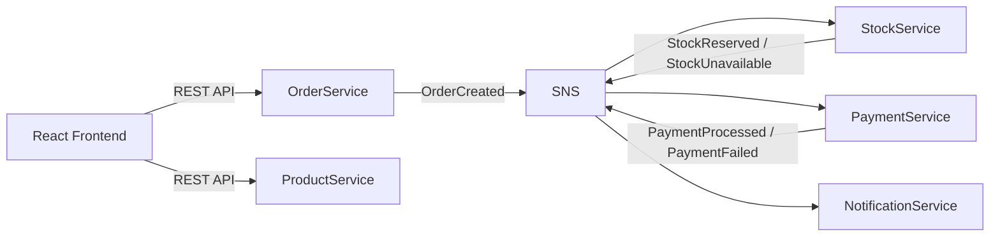
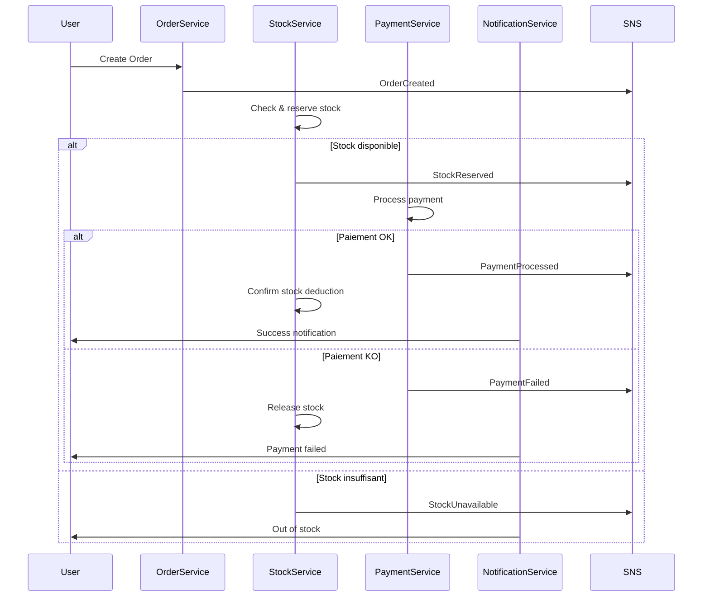

# e-commerce-event-driven-demo
Conception et implémentation d’une plateforme e-commerce event-driven basée sur microservices (Spring Boot), déployée en local via docker compose et sur AWS via ECS Fargate, SNS/SQS et Terraform, incluant la gestion des transactions distribuées via Saga pattern.

# 🛒 E-commerce Event-Driven Platform (Spring Boot + Kafka + AWS)

## 📌 Description

Ce projet est une plateforme e-commerce basée sur une architecture microservices event-driven, construite avec :

* Spring Boot (Java)

* Messaging : Kafka (en local) et AWS SNS/SQS (sous AWS)

* Cloud : AWS (ECS Fargate, RDS, SQS, SNS)

* Infrastructure : Terraform

🎯 Objectif : démontrer des compétences en :

* Architecture microservices distribuée

* Event-driven design

* AWS

* CI/CD & containerisation

* Observabilité (Prometheus, Grafana, Zipkin)

Inclus également:

* gestion des erreurs de traitement des messages Kafka/SQS avec retries et Dead Letter Topic/Queue

* circuit breaker

* pattern d'outbox pour garantir la publication sure des événements

* pattern d'idempotence pour garantir la non duplication du traitement des événements

* saga pour garantir la cohérence des données entre les microservices, avec compensation en cas d'erreur

## 🏗️ Architecture globale



## 🔄 Workflow métier (Saga Pattern)



## ⚙️ Microservices
### Product Service

* Gestion du catalogue produits

* Base de données : PostgreSQL

### Order Service

* Création des commandes

* Publie OrderCreated

### Stock Service

* Réserve le stock (soft reserve)

* Publie :

    * StockReserved

    * StockUnavailable

* Gère rollback via PaymentFailed

### Payment Service

* Traite les paiements

* Consomme StockReserved

* Publie :

    * PaymentProcessed

    * PaymentFailed

### Notification Service

* Envoie des notifications utilisateur

* Consomme tous les événements métier

## 📨 Exemple d’événements

### OrderCreated
```json
{
  "orderId": "123",
  "items": [{"productId": "p1", "quantity": 2}]
}
````

### StockReserved
```json
{
  "orderId": "123",
  "status": "RESERVED"
}
````

### PaymentFailed
```json
{
  "orderId": "123",
  "reason": "Card declined"
}
```

## 🐳 Lancer en local (Docker Compose)
```bash
docker-compose --profile app up --build
````

Accès :

* Product API → http://localhost:8081

* Order API → http://localhost:8082

## ☁️ Déploiement AWS
### Services utilisés :

* ECS Fargate → microservices

* RDS → bases PostgreSQL

* SNS/SQS → messaging

* CloudWatch → logs

### Déploiement :
```bash
terraform init
terraform apply
````

## 🚀 CI/CD

GitHub Actions :

* Docker build

* Push vers ECR


## ✨ Bonus (améliorations possibles)

* Implémentation d'un frontend

* Authentification (JWT / Cognito)

* Ajouts de tests

## 📌 Points forts du projet

✔️ Architecture réaliste (comme en entreprise)

✔️ Event-driven + microservices

✔️ Gestion des erreurs avancée (Saga)

✔️ Full AWS + Terraform

✔️ Déployable et scalable

## 👨‍💻 Auteur

Projet réalisé dans le cadre d’un portfolio backend/cloud engineering.